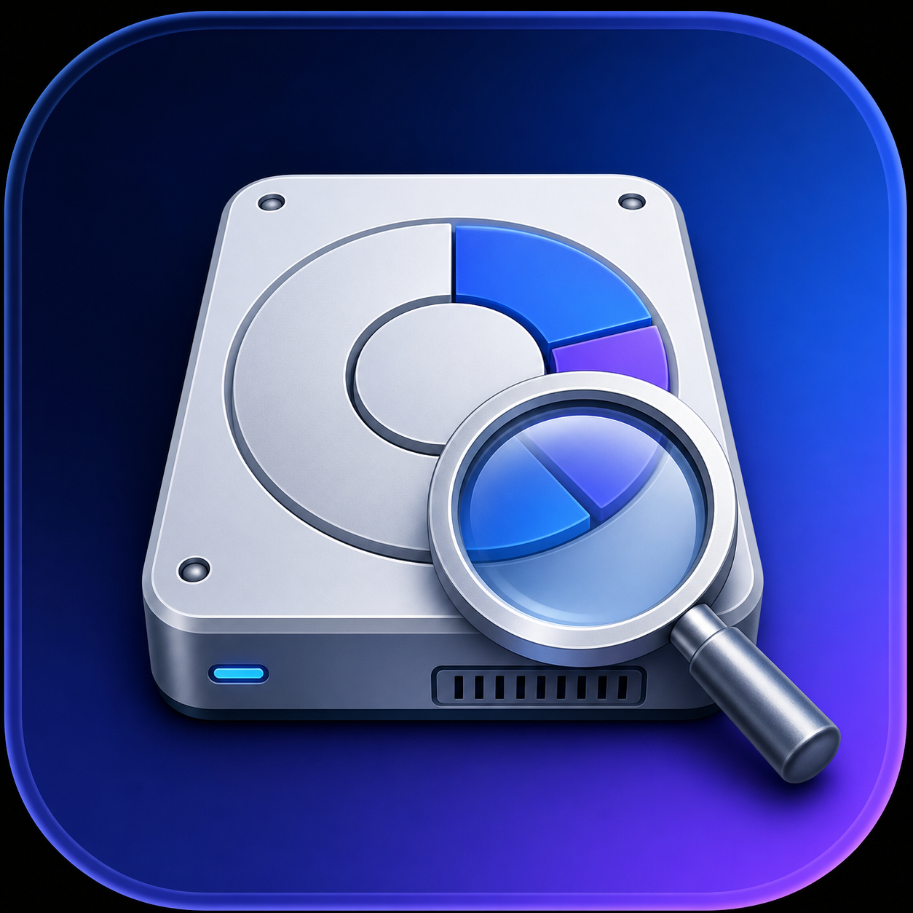

<p align="center">
  
</p>

<h1 align="center">DiskScope</h1>

<p align="center">
  <strong>Finde Speicherfresser. Verstehe deinen Mac. Räume gezielt auf.</strong>
</p>

<p align="center">
  100 % lokal · Open Source · Keine Abos · Keine automatische Löschung
</p>

DiskScope zeigt dir, **was den Speicher deines Macs wirklich belegt**. Analysiere
Macintosh HD, deinen Benutzerordner, externe Laufwerke oder einen beliebigen
Ordner und erkenne auf einen Blick, wo große Dateien, umfangreiche Apps,
mögliche Duplikate und unnötige Daten liegen.

Statt dich mit unübersichtlichen Finder-Fenstern oder pauschalen
Speicherangaben allein zu lassen, macht DiskScope deine Ordnerstruktur
nachvollziehbar: Du siehst die Größe jedes Bereichs, navigierst direkt durch
Unterordner und kannst ausgewählte Inhalte kontrolliert in den Papierkorb
verschieben.

Alles bleibt auf deinem Mac. DiskScope benötigt kein Benutzerkonto, überträgt
keine Dateinamen und löscht niemals etwas ohne deine Bestätigung.

## Download und Installation

**[DiskScope direkt als DMG herunterladen](https://github.com/dadakaev10-sketch/DiskScope/releases/latest/download/DiskScope.dmg)**

Alternativ findest du die DMG und alle Versionshinweise unter
[GitHub Releases](https://github.com/dadakaev10-sketch/DiskScope/releases/latest).
Ein Apple-Developer-Account ist für die Installation **nicht** erforderlich.

Die aktuelle Open-Source-Version ist noch nicht von Apple notarisiert. Deshalb
zeigt macOS beim ersten Start eine Sicherheitsmeldung:

1. `DiskScope.app` aus der DMG in den Ordner „Programme“ ziehen.
2. DiskScope einmal öffnen.
3. Falls macOS die App blockiert: „Systemeinstellungen“ → „Datenschutz &
   Sicherheit“ öffnen und unter „Sicherheit“ auf „Dennoch öffnen“ klicken.
4. DiskScope erneut öffnen und den einmaligen Festplattenvollzugriff erlauben,
   wenn auch geschützte Ordner analysiert werden sollen.

Lade ausführbare Dateien ausschließlich von der offiziellen Release-Seite
dieses Repositorys herunter.

## Was DiskScope für dich findet

- **Die größten Speicherfresser:** Sortiere Dateien und Ordner nach Größe und
  erkenne sofort, wo besonders viel Speicher belegt wird.
- **Die komplette Ordnerstruktur:** Navigiere durch Unterordner, Pfade und
  versteckte Elemente, ohne den Überblick zu verlieren.
- **Große Apps:** Sieh, wie viel Platz installierte Programme tatsächlich
  beanspruchen, und verschiebe löschbare Apps bei Bedarf in den Papierkorb.
- **Mögliche Duplikate:** Finde Dateien mit gleichem Namen und vergleiche ihre
  Größen, auch wenn sie in unterschiedlichen Ordnern liegen.
- **Aufräumkandidaten:** Erhalte Hinweise auf große Cache-, Protokoll-,
  temporäre und Modelldateien – ohne automatische Löschaktionen.
- **Interne und externe Speicher:** Analysiere Macintosh HD, Benutzerordner,
  externe Laufwerke und frei ausgewählte Verzeichnisse.
- **Logische und physische Größe:** Vergleiche Dateigröße und den tatsächlich
  auf dem Datenträger zugeordneten Speicher.
- **Gespeicherte Analysen:** Wechsle zwischen den letzten fünf Scan-Ergebnissen,
  ohne jeden Ordner erneut analysieren zu müssen.

## Entwickelt für Kontrolle statt Risiko

- Echtzeit-Fortschritt während der Analyse
- Mehrfachauswahl für Dateien und Ordner
- Finder-Integration für eine schnelle Kontrolle
- Verschieben ausschließlich nach Bestätigung in den macOS-Papierkorb
- geschützte Systembereiche sind nicht direkt löschbar
- Sprachwahl zwischen Deutsch, Englisch und Spanisch
- vollständig lokale Verarbeitung ohne Cloud oder Benutzerkonto

## Zugriff beim ersten Start

Beim ersten Start erklärt DiskScope einmalig, wie der vollständige
Festplattenzugriff in macOS freigegeben wird. Diese Freigabe muss aus
Sicherheitsgründen vom Nutzer selbst bestätigt werden. Danach fragt DiskScope
nicht erneut, solange App-Identität und Systemeinstellung erhalten bleiben.

## Bauen

Voraussetzung sind macOS 14 oder neuer und die Apple Command Line Tools. Die
App wird als Universal Binary für Apple Silicon und Intel gebaut:

```sh
./build.sh
```

Das Ergebnis liegt anschließend unter `build/DiskScope.app`.

## Lizenz

DiskScope steht unter der [MIT-Lizenz](LICENSE).

---

**Find what is taking up space on your Mac.** DiskScope is a native,
open-source storage analyzer for macOS. Explore folder sizes, identify large
files and apps, spot possible duplicates, and review cleanup candidates without
giving up control of your data. Everything is processed locally, and nothing
is deleted without your confirmation.
